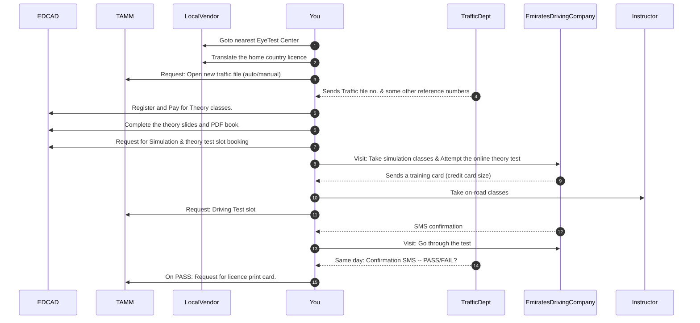

### UAE Driving Licence Process - Golden Chance for Indian Licence Holders

```mermaid 
sequenceDiagram
    autonumber
    participant EDCAD
    participant TAMM
    participant LocalVendor
    participant You
    participant TrafficDept
    participant EmiratesDrivingCompany
    participant Instructor
    participant EmiratesDrivingCompany
    
    
    You->>LocalVendor: Goto nearest EyeTest Center

    You->>LocalVendor: Translate the home country licence

    You->>TAMM: Request: Open new traffic file (auto/manual)

    TrafficDept-->>You: Sends Traffic file no. & some other reference numbers

    You->>EDCAD: Register and Pay for Theory classes.
    You->>EDCAD: Complete the theory slides and PDF book.

    You->>EDCAD: Request for Simulation & theory test slot booking

    You->>EmiratesDrivingCompany: Visit: Take simulation classes & Attempt the online theory test

    EmiratesDrivingCompany-->>You: Sends a training card (credit card size)

    You->>Instructor: Take on-road classes

    You->>TAMM: Request: Driving Test slot
    EmiratesDrivingCompany-->>You: SMS confirmation

    You->>EmiratesDrivingCompany: Visit: Go through the test

    TrafficDept-->>You: Same day: Confirmation SMS -- PASS/FAIL?


    You->>TAMM: On PASS: Request for licence print card.
    
    


    

```
