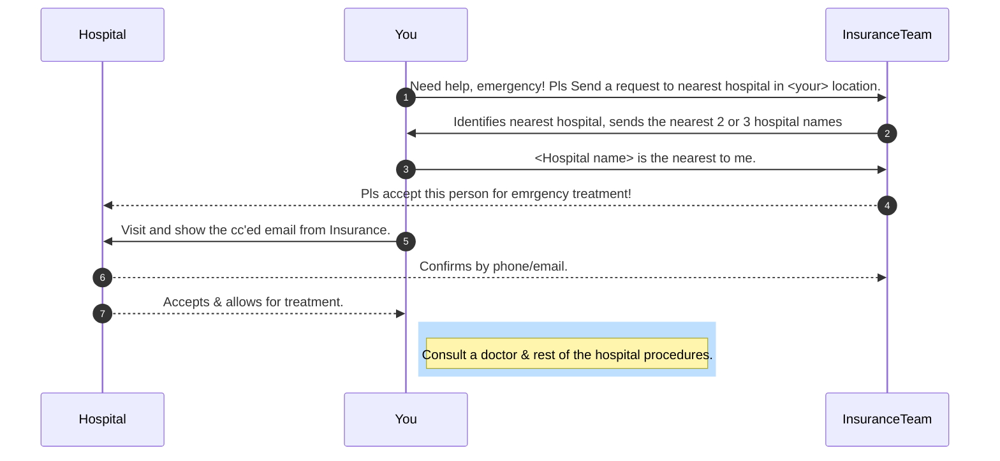
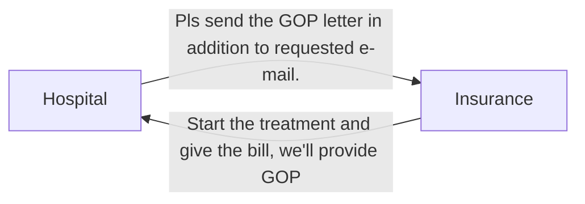

## How use Travel Insurance before getting E-id?




---

### @Burjeel 

Points to note:
- They will accept NextCare insurance, regular type.
- But they do not accept the `Travel Insurance` (sub category within NextCare)

```
Conclusion:
 Hospital & Insurance talked to each other & you, they both will agreed on a common point to 
 Pay the bill by patient and reimburse it later.
 ```
 
 ---

### @NMC


`GOP = Gaurantee of Payment letter`



```
Conclusion: Never ending loop.
 Hospital & Insurance talked to each other & you, they both will agreed on a common point to 
 Pay the bill by patient and reimburse it later.
 ```
 
 --- 
 
 ### Insurance claim process
 ```mermaid
 flowchart LR
 
    A[You send the original bill & docs] --> B[Insurance Evaluates] --> C[Reimburse]
 ```
 
 ```
Conclusion: No Guarantee you will get all the amount.
 
 ```
 
 
